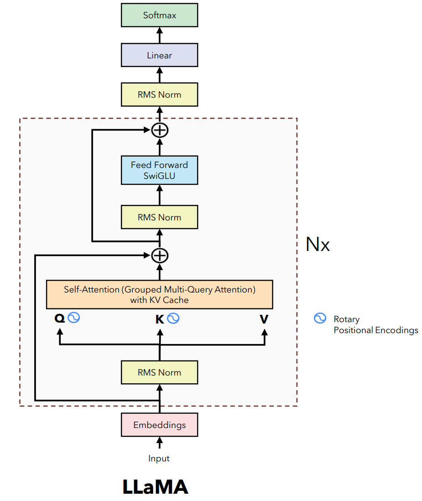
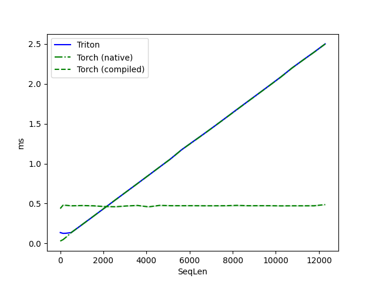
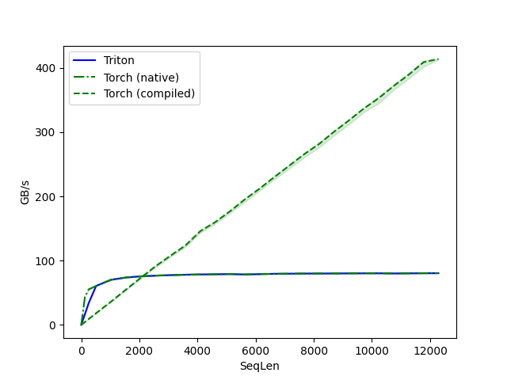
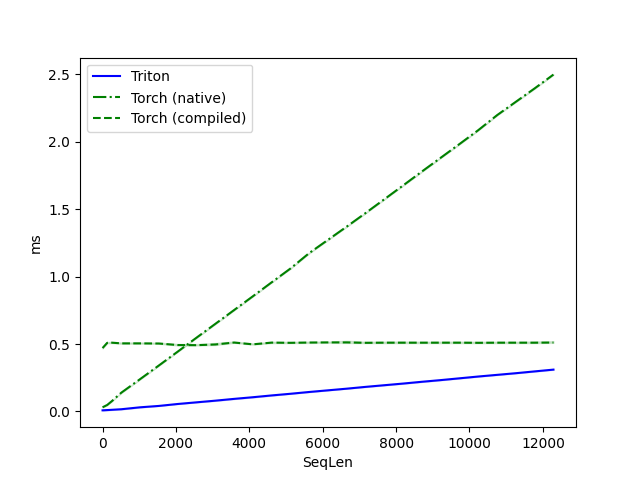
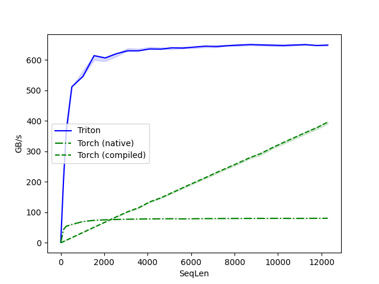
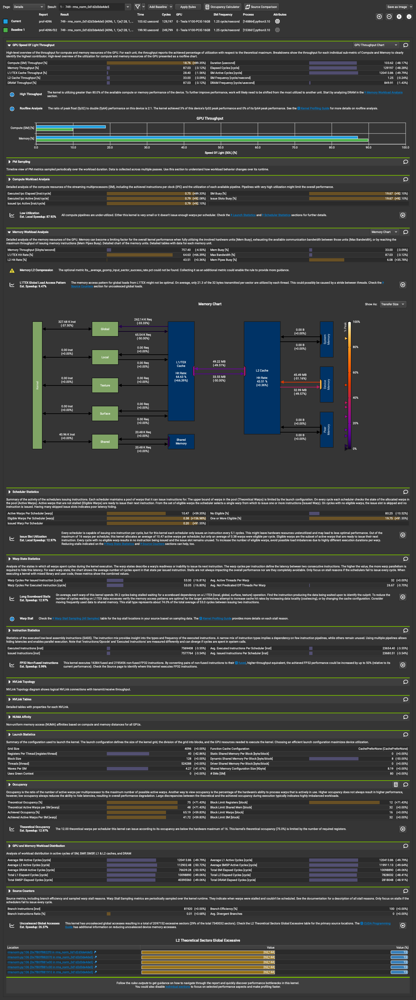

# Implementation of RMS Normalization

Root Mean Square (RMS) normalization is a technique used to normalize the
amplitude of a signal. It is used in many signal processing applications, such
as audio processing, image processing, and data analysis.  It is also a layer in the `LLama2` model, which is a state-of-the-art Gen AI model.

In the [paper](https://dl.acm.org/doi/pdf/10.5555/3454287.3455397) "Root Mean Square Layer Normalization" by Zhang and Sennrich, the authors hypothesize that the re-scaling invariance is the reason for success of LayerNorm, rather than re-centering invariance. As such, they propose a new normalization technique called Root Mean Square Layer Normalization (RMSNorm) that normalizes the input activations to have unit root mean square (RMS) value.

```
@article{zhang2019root,
  title={Root mean square layer normalization},
  author={Zhang, Biao and Sennrich, Rico},
  journal={Advances in Neural Information Processing Systems},
  volume={32},
  year={2019}
}
```


## Formula

$$\bar{a_i} = \frac{a_i}{RMS(\vec{a})}g_i$$

where:

$$RMS(\vec{a}) = \sqrt{eps + \frac{1}{n} \sum_{i=1}^{n} a_i^2}$$

* $\bar{a_i}$ (a-bar-i): This represents the **normalized value** of element $i$ after applying RMSNorm. The normalization process rescales the values in $a$ to have a different scale compared to the original values.
* $a_i$: This represents the **original value** of element $i$ in the input vector $a$ before any normalization is applied.
* $RMS(a)$: This term represents the **Root Mean Square** of the elements in vector $a$. It calculates a single value that indicates the spread or magnitude of the values in $a$. 
* $g_i$ (gamma-i): This represents a **learnable scaling factor**, specific to element $i$. It's not included in all formulations of RMSNorm. Some implementations allow the model to learn this factor to introduce more control over the normalization process for each element.
* $eps$: This is a small value (usually close to zero) added to the denominator to prevent division by zero. It's a common practice to avoid numerical instability when calculating the RMS value.


## Torch Implementation

```python
class RMSNorm(nn.Module):
    def __init__(self, dim: int, eps: float = 1e-6):
        super().__init__()
        self.eps = eps
        # The gamma parameter
        self.weight = nn.Parameter(torch.ones(dim))

    def _norm(self, x: torch.Tensor):
        # (B, Seq_Len, ModelDim) * (B, Seq_Len, 1) = (B, Seq_Len, ModelDim)
        # rsqrt: 1 / sqrt(x)
        return x * torch.rsqrt(x.pow(2).mean(-1, keepdim=True) + self.eps)

    def forward(self, x: torch.Tensor):
        # (ModelDim) * (B, Seq_Len, ModelDim) = (B, Seq_Len, ModelDim)
        return self.weight * self._norm(x.float()).type_as(x)
```


## Use in LLama


Image from: https://github.com/hkproj/pytorch-llama/blob/main/Slides.pdf


# Assignment

- Implement RMSNorm in CUDA, for 3D tensors using half precision
- Document thought process
- Identify and discuss potential optimizations
- Model size refered to as ModelDim is `>=4096` and multiple of `32`

## TLDR

Implemented the full layer using triton. Performance is great. After fp16
conversion, kernel is still memory bound. Issue may be with strided access
leading to low l1 and l2 hit ration (less than 50%).

## Thought Process

0. Setup some profiling infrastructure and tests
    - `torch.profiler` and `nsys` for "end-to-end"
    - `ncu` for kernel evaluation
    - I will start by keeping `ModelDim` constant and varying `SeqLen`, with `Batch Size of 1`
1. Study and Implement RMSNorm in python to serve as a baseline
2. Since we have 3D tensors as inputs, I assume the dimensions (B, SeqLen, ModelDim)
    - `B` represents number of batches
        - All batches are assumed to have the **same** size of **(SeqLen, ModelDim)**
    - `SeqLen` represents the size of the sequence, i.e. tokens in a batch
    - `ModelDim` represents the size of the embeddings to represent a token
        - Also represents the size of the trainable parameter (weights) vector $\bar{g}$
3. All inputs are computed against the same $\bar{g}$ weights
        - The same set of learnable scaling factors ($g_i$) would be applied to all input vectors in the sequence
4. It makes sense to keep the $\bar{g}$ in GPU Memmory, and reuse the values until we go over all (B, SeqLen, : ) examples
5. The RMSNorm has many subkernels, some depend on the weights. Fusion can be relevant so we can re-use intermediate results when possible.
6. I will start by implementing each kernel individually, from innermost to outermost
    1. square
    2. mean (reduction('+') then devide by N)
    3. add single scalar (eps)
    4. sqrt
    5. inverse
    6. element_wise multiply
7. Many of these kernels can reuse builtin libraries from [CUB](https://nvidia.github.io/cccl/cub/modules.html). We can also implement these kernels with [Triton](https://github.com/openai/triton)
8. Decided to take the Triton approach as it is an MLIR based compiler which I want to learn


## Future investigations / Potential Optimizations

- [x] Fusion of kernels
  - less access to GPU main memory
- [?] Keeping weights in shared memory
  - Triton compiler allocates shared memory, confirmed by using `ncu`
- [x] Reduction can leverage a parallel implementation
- [x] Reduction (mean) causes the stride on the last dimension to be 1, which can be hardcoded
- [ ] Triton provides an autotunner that can be used to select warp sizes (and block sizes)
    - [ ] Limit block size on python driver
       - Kernel was implemented to handle ModelDims of "any" size, but this does not mean that doing so is smart
       - Big blocks may force eviction from registers
       - Triton seem to have lunched the kernel with block dim: 128, must explore if this is optimal
- [ ] Naive run of NCU shows 50% l2 cache hit and low Compute utilization. This indicates that we can still improve
- [ ] Enabling half precision required to relax tolerance in tests
  - must investigate why


## Notes on implementations

### First implementation

In my first implementation I benchmarked the runtime and bandwidth used by a
layer running RMSNorm on an input tensor with dimensions 
`(Batch=1, SeqLen=sweep, ModelDim=4096)`. The sweep included:
`[1, 128, 256] + [512 * i for i in range(1, 25)]`.

**Rationale**: I want to benchmark sequence lengths from 1 to 12,800.
`llama2` context size is 8k tokens, but longer context len extensions are
possible.
At first I observed that it is the only way to saturate GPU memory BW of V100.
I want to include 1, 128, and 256 to see the effect of small sequence
lengths.

The figures below show the runtime performance in [ms] and **a proxy** for
utilized memory bandwidth. Runtime performance y-axis is correct, but memory BW
y-axis is scaled and should be used as a proxy 
**DO NOT CONSIDER THE ABSOLUTE VALUE**, just the trend.

<p float="left">
  
   
</p>

- Baseline in `torch` and `torch.compile` are derived from LLama3's implementation of [RMSNormL3 line 37](baselines/rmsnorm.py).
- Triton results are derived from my implementation of RMSNorm Layer in python, with **only** the **square** function in triton.
  - Implementation: [PartialTritonRMSNorm](/res/artifacts/initial_impl/artifacts/artifacts/rmsnorm.py)
  - The performance is underwhelming.
  - With only the square krnl from triton, little re-use happens in the register file. All data goes through main memory.
- When benchmarking a 1x4096x4096 input (in a proper profiling schedule)...
  - We observe Good SM utilization, but poor BW. This is expected since we can saturate the device with the `square` computation
  - 1 multiplication per element and great sequential and coalesced access pattern.

From the profiling [trace](res/artifacts/initial_impl/artifacts/rmsnorm_trace_4096x4096_4.json):
```
  {
    "ph": "X", "cat": "kernel", "name": "square_kernel_0d1d2de3de4de", "pid": 0, "tid": 7,
    "ts": 1713738903328187, "dur": 164,
    "args": {
      "External id": 322,
      "queued": 0, "device": 0, "context": 1,
      "stream": 7, "correlation": 322,
      "registers per thread": 20,
      "shared memory": 0,
      "blocks per SM": 51.200001,
      "warps per SM": 819.200012,
      "grid": [4096, 1, 1],
      "block": [512, 1, 1],
      "est. achieved occupancy %": 100
    }
  },
```

### Itermediate steps

I implemented the other layers, fusing them on the main triton kernel. At every
fused layer, I would see performance gains.

### Final implementation (as of April 22)

I proceded on implementing all operation of RMSNorm in a fused triton kernel. Results are great.
The graphs below use the same baselines as above, but Triton represents my fused implementation.

<p float="left">
  
   
</p>

- We have very high memory BW even for small kernels (**again, ignore the absolute value**).
  - Further investigation with NCU is necessary
- We have better runtime performance accross the entire sweep
- Implementation of fused triton kernel line 73: [rms_norm](res/artifacts/final_impl/artifacts/rmsnorm.py)


From the profiling [trace](res/artifacts/final_impl/artifacts/rmsnorm_trace_4096x4096_4.json):
```
{
  "ph": "X", "cat": "kernel", "name": "rms_norm_0d1d2d3de4de5", "pid": 0, "tid": 7,
  "ts": 1713773815815011, "dur": 102,
  "args": {
    "External id": 98,
    "queued": 0, "device": 0, "context": 1,
    "stream": 7, "correlation": 98,
    "registers per thread": 40,
    "shared memory": 8,
    "blocks per SM": 51.200001,
    "warps per SM": 204.800003,
    "grid": [4096, 1, 1],
    "block": [128, 1, 1],
    "est. achieved occupancy %": 75
  }
},
```


#### NCU

Since I dont have the a fused *baseline* kernel implementing the full RMSNorm, I compared my implementation in triton with FP32 (green) and FP16 (blue) datatypes, and check additional metrics on NCU.

- FP16 improves upon FP32, reducing runtime from 199us to 103us.
- Both have low SM utilization, but using a reduced datatype almost doubles the utilization.
- Current implementation of the kernel is memory bound.
  - Cache hit ration is low. Strided access may be the problem.

NCU of 4096x4096 input to [rms_norm](res/artifacts/final_impl/artifacts/rmsnorm.py) kernel, running on a v100-16GB, shown below.

<details>
  <summary>Click Here to Open NCU Report for FP32 (basline) vs FP16</summary>
  
</details>

# Additional Resources

## Commands

To visualize MLFlow artifacts...

```bash
# In host, bind the port 5000 to remote
ssh -N -L 5000:localhost:5000 <server_username>@<server_ip>
# Enter the directory that contains a `mlruns` folder
cd notebook
# Start MLFlow on docker
docker run --rm --entrypoint mlflow -e MLFLOW_HOST="0.0.0.0" -v $(pwd):/workspaces/rms-norm-exercise/notebooks -w /workspaces/rms-norm-exercise/notebooks -p 5000:5000 ghcr.io/mlflow/mlflow:latest server
```

To run ncu:

```bash
cd profiler
ncu --set full -f -o prof/prof python runonce.py
```

## Additional Resources

LLamma2 implementation from scratch:
- https://www.youtube.com/watch?v=oM4VmoabDAI&ab_channel=UmarJamil

Integrating kernel in pytorch:
- https://github.com/cuda-mode/profiling-cuda-in-torch/tree/main/load_inline_cuda
